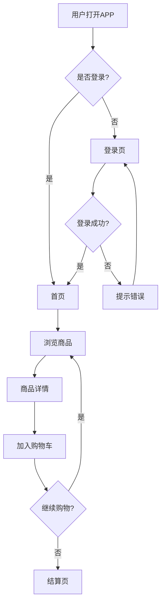

# 6-1-2 设计阶段AI辅助

**所属模块**: 模块6 - AI编程实战工作流  
**学习难度**: ★★★☆☆（中等）  
**建议学时**: 2小时  
**前置知识**: [6-1-1 需求阶段AI辅助](6-1-1-需求阶段AI辅助.md)、产品设计基础  
**后续学习**: [6-1-3 开发阶段AI辅助](6-1-3-开发阶段AI辅助.md)

---

## 🎯 学习目标

完成本节后，你将能够：

1. 理解AI在产品设计阶段的具体应用场景和价值
2. 掌握AI辅助信息架构设计和交互流程设计的方法
3. 学会用AI工具快速生成原型和交互说明
4. 识别AI辅助设计的局限性，知道何时需要专业设计师介入

---

## 📖 核心内容

### 一、设计阶段的核心任务与AI切入点

**通俗比喻**：如果说需求阶段是决定"建什么房子"，设计阶段就是画"建筑图纸"。AI就像你的"智能绘图助手"，能快速生成多种方案供你选择，但最终的审美判断和用户体验把控还是靠你。

设计阶段的核心任务：

| 任务 | 传统做法 | AI辅助方式 | 效率提升 |
|------|---------|-----------|---------|
| 信息架构设计 | 手工梳理，反复修改 | AI根据内容自动生成结构建议 | 50%+ |
| 交互流程设计 | 手绘草图，多次迭代 | AI生成流程图和线框图 | 40%+ |
| 原型制作 | Axure/Sketch数天 | AI生成可交互原型 | 60%+ |
| 设计系统建立 | 从零搭建组件库 | AI辅助生成设计规范 | 30%+ |

### 二、AI辅助信息架构设计

#### 1. 网站地图（Sitemap）生成

**提示词模板**：

```
请为以下产品生成信息架构（Sitemap）：
- 产品类型：[如电商APP、SaaS管理后台]
- 核心功能：[列出功能]
- 目标用户：[描述]

要求：
- 采用三级页面结构
- 每个页面标注核心功能点
- 输出为树形结构文本
- 说明设计理由和导航逻辑
```

**输出示例**（电商APP）：

```
首页
├── 商品浏览
│   ├── 分类导航（一级/二级分类）
│   ├── 搜索页（搜索+筛选+排序）
│   └── 推荐页（个性化推荐）
├── 商品详情
│   ├── 商品展示（图片/视频/评价）
│   ├── 规格选择
│   └── 加入购物车
├── 购物车
│   ├── 商品管理（增删改）
│   └── 结算入口
├── 订单中心
│   ├── 订单列表（状态筛选）
│   ├── 订单详情
│   └── 物流追踪
└── 个人中心
    ├── 账户信息
    ├── 收货地址
    └── 客服入口
```

#### 2. 导航结构合理性检验

**提示词模板**：

```
请评估以下信息架构的合理性：
[粘贴你的信息架构]

评估维度：
1. 层级深度（建议不超过4级）
2. 功能分组逻辑（是否按用户心智模型分组）
3. 核心路径长度（完成核心任务的点击次数）
4. 遗漏的功能入口

给出优化建议。
```

### 三、AI辅助交互流程设计

#### 1. 用户流程图生成

**Mermaid流程图示例**（可直接在支持Markdown的编辑器中渲染）：



**提示词模板**：

```
请为以下用户场景生成流程图（Mermaid格式）：
场景：用户在电商APP完成一次购买
关键步骤：打开APP、浏览商品、加入购物车、填写地址、支付、确认订单
异常处理：登录失败、库存不足、支付失败

要求：
- 包含正常流程和异常分支
- 标注每个决策点的判断条件
- 输出Mermaid语法代码
```

#### 2. 交互说明文档生成

**提示词模板**：

```
请为以下页面生成交互说明文档：
页面名称：[如商品详情页]

要求包含：
1. 页面布局说明（各区域位置和占比）
2. 交互规则（点击、滑动、长按等手势）
3. 状态变化（加载中、空状态、错误状态）
4. 动效建议（过渡动画、反馈动画）
5. 异常处理（网络异常、数据为空、权限不足）

输出格式：Markdown表格
```

### 四、AI辅助原型制作

#### 1. 线框图（Wireframe）生成

目前AI生成线框图的几种方式：

| 工具类型 | 代表工具 | 适用场景 | 输出质量 |
|---------|---------|---------|---------|
| 文本转原型 | v0.dev、Galileo AI | 快速验证概念 | 中等 |
| 截图转设计 | Uizard、Figma AI | 已有参考设计 | 较高 |
| 草图转原型 | Motiff、即时AI | 手绘草图数字化 | 中等 |
| AI辅助设计 | Figma AI、MasterGo AI | 专业设计迭代 | 高 |

**实操流程**（以文本转原型为例）：

```
第1步：用文字描述页面布局
   ↓
第2步：AI生成HTML/CSS代码或设计稿
   ↓
第3步：手动调整细节
   ↓
第4步：导出为可交互原型
```

**文本描述示例**：

```
请生成一个商品详情页的HTML线框图，要求：
- 顶部：商品主图轮播（占页面40%高度）
- 中部：商品名称、价格、销量信息
- 下部：规格选择器、数量选择、"加入购物车"和"立即购买"按钮
- 底部：商品详情、评价、推荐商品三个Tab
- 使用简单的灰色占位块，不需要精美样式
- 适配移动端宽度（375px）
```

#### 2. 交互原型快速搭建

对于产品经理而言，不需要精美设计，关键是验证流程。推荐工作流：

```
AI生成HTML原型 → 添加基础交互（跳转、弹窗） → 分享给团队验证
```

### 五、AI辅助设计评审

#### 设计检查清单AI生成

**提示词模板**：

```
请生成一份产品设计评审检查清单，适用于：
- 产品类型：[如移动端APP]
- 目标用户：[如25-35岁职场人群]

检查维度：
1. 信息架构（导航清晰度、层级深度）
2. 交互设计（操作效率、反馈及时性）
3. 视觉设计（一致性、可读性、品牌感）
4. 无障碍设计（字体大小、对比度、屏幕朗读）
5. 异常流程（网络异常、空状态、错误提示）

每个维度列出5-10个具体检查项。
```

### 六、AI辅助设计的边界

**产品经理需要知道的**：

| 场景 | AI能做什么 | AI不能做什么 | 建议 |
|------|-----------|-------------|------|
| 信息架构 | 生成结构建议 | 理解业务特殊性 | AI生成+人工调整 |
| 交互流程 | 输出标准流程 | 处理复杂业务逻辑 | AI辅助+团队评审 |
| 线框原型 | 快速生成初稿 | 精确像素级还原 | 用于讨论，不用于验收 |
| 设计规范 | 提供通用规范 | 匹配品牌调性 | 设计师主导，AI辅助 |
| 用户体验 | 指出常见问题 | 替代用户测试 | AI检查+真实用户验证 |

### 七、实操工作流：从需求到可交互原型

```
第1步：AI生成信息架构（30分钟）
   ↓
第2步：AI生成核心页面流程图（30分钟）
   ↓
第3步：AI生成线框图/HTML原型（1小时）
   ↓
第4步：添加基础交互（1小时）
   ↓
第5步：团队评审和修改（2小时）
   ↓
第6步：输出设计文档（1小时）
```

**时间对比**：传统方式约20-30小时，AI辅助后约6-7小时。

---

## 📦 案例分析

### 案例1：某在线教育产品的课程详情页重构

**背景**：原有课程详情页转化率低，用户反映"找不到关键信息"。

**AI辅助过程**：
1. 用AI分析用户行为数据，发现80%的用户在30秒内离开
2. AI建议重构信息架构，将"课程大纲"和"讲师介绍"前置
3. AI生成新的线框图，突出核心卖点
4. 团队评审后快速验证

**结果**：重构后页面停留时间提升120%，转化率提升35%。

### 案例2：某B端SaaS产品的后台设计

**背景**：产品经理需要在1周内完成后台管理系统的原型设计。

**AI辅助过程**：
1. 用AI生成标准的后台信息架构（左侧导航+顶部操作区+中间内容区）
2. AI根据功能清单生成各页面的流程图
3. 使用AI原型工具快速搭建可交互原型
4. 开发团队基于原型评估技术方案

**结果**：设计周期从3周缩短到1周，开发评估时间减少50%。

---

## 💡 产品经理视角的关键思考

1. **设计不是"好不好看"，而是"好不好用"**：产品经理关注的是信息架构是否清晰、交互流程是否顺畅，而不是像素级的视觉细节。
2. **AI原型的价值在于沟通**：原型不是最终产品，而是团队沟通的语言。粗糙但清晰的线框图比精美但逻辑混乱的设计稿更有价值。
3. **理解设计原则比使用工具更重要**：AI工具会不断迭代，但信息架构原则、交互设计原则是通用的。
4. **知道何时需要专业设计师**：当产品进入品牌塑造、视觉精细化阶段时，专业设计师的价值不可替代。

---

## 📝 思考问题

1. 如果你要为一个全新的产品做信息架构设计，你会如何组合使用AI工具和人工判断？
2. AI生成的交互流程图可能存在哪些"过于理想化"的问题？你如何在评审中发现并修正这些问题？
3. 对于面向不同用户群体（如老年人 vs 年轻人）的产品，AI辅助设计需要特别注意什么？

---

## 🔗 相关链接

- 上一节：[6-1-1 需求阶段AI辅助](6-1-1-需求阶段AI辅助.md)
- 下一节：[6-1-3 开发阶段AI辅助](6-1-3-开发阶段AI辅助.md)
- 扩展阅读：[6-2-1 用AI快速搭建MVP](6-2-1-用AI快速搭建MVP.md)

---

*分析日期：2026-04-27 | 总字数：约2,500字*
